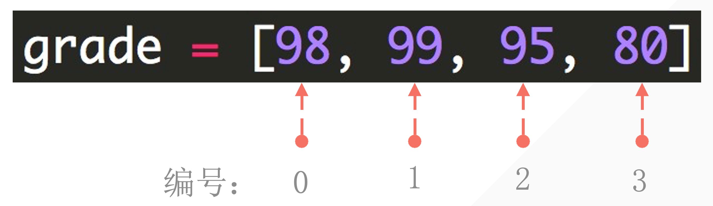
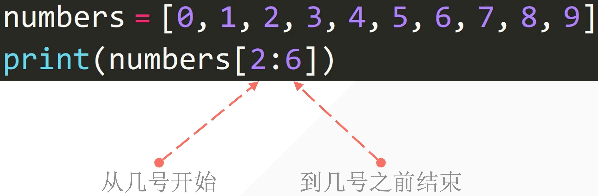

# 1. 列表結構

· 利用 中括號 表示列表

· 列表内的元素用 逗號 隔開

· 注意是 英文輸入法 下的逗號

```python
student1 = ['lilei', 18, 'class01', 201901]
student2 = ['hanmeimei', 19, 'class2', 201902]
print(student1)
print(student2)

# ---output---
['lilei', 18, 'class01', 201901]
['hanmeimei', 19, 'class2', 201902]
```

列表的 可变性：可以修理列表的内容。

· 字符串强制轉換成列表

```python
string_to_list = list('Bornforthis')
print(string_to_list)

# ---output---
['B', 'o', 'r', 'n', 'f', 'o', 'r', 't', 'h', 'i', 's']
```

# 2. 獲取列表中的某個元素


## 2.1. 列表下標的組成

編程語言中通常 第一個位置的編號是0。



## 2.2. 提取單個元素

中括號内數字指定元素位置

```python
grade = ['hanmeimei', 19, 'class02', 201902]
print(grade[-1])  # 98

# ---output---
201902
```

## 2.3. 獲取列表中連續的幾個元素



· 中括號内用 起姑位置：結束位置 描述

· 注意：不包括結束位置的元素

```python
numbers = [0, 1, 2, 3, 4, 5, 6, 7, 8, 9]
print(numbers[2:6])  # [2, 3, 4, 5]

# ---output---
[2, 3, 4, 5]
```

· 更細緻的用法起始位置：結束位置：步長

· 注意：不包括結束位置的元素

```python
numbers = [0, 1, 2, 3, 4, 5, 6, 7, 8, 9]
print(numbers[1:7:2])  # [1, 3, 5]

# ---output---
[1, 3, 5]
```

```python
numbers = ['a', 'b', 'c', 'd', 'e', 'f', 'g', 'h', 'i', 'j']
print(numbers[0:11:2])  # [1, 3, 5]

# ---output---
['a', 'c', 'e', 'g', 'i']
```

```python
student2 = ['a', 'b', 'c', 'd', 'e', 'f', 'g', 'h', 'i', 'j']
print(student2)

student2[3:] = list('12345')
print(student2)

# ---output---
['a', 'b', 'c', 'd', 'e', 'f', 'g', 'h', 'i', 'j']
['a', 'b', 'c', '1', '2', '3', '4', '5']
```

```python
numbers = [1, 5]
print(numbers[1:1])  # 因為[1:1]前面的1可以到5,但是後面不可以把数量是5,so 到[]

# ---output---
[]
```

```python
numbers = [1, 5]

numbers[1:1] = [2, 3, 4] # 因為[1:1]前面的1可以到5,但是後面不可以把数量是5,但[1:1]是[2, 3, 4],So 是[1, 2, 3, 4, 5]
print(numbers)

# ---output---
[1, 2, 3, 4, 5]
```

```python
numbers = [1, 2, 3, 5, 6]
position = int(input('Enter position: '))
value = int(input('Enter value: '))
numbers[position:position] = [value]
print(numbers)

# ---output---
# Enter position: 3
# Enter value: 4
# [1, 2, 3, 4, 5, 6]
```

# 5. 在列表的特定位置插入元素「.insert(index, element)」

.insert(index, element) 是一個列表的基本方法，用于在列表的指定位置插入個元素

它的基本語法是：

```python
list,insert(index, element)
```

index : 指定要插入元素的位置。索引從 0 開始。如果指定的索引超出了列表的當前長度「不會報錯」，則元素將被加到表的末尾。

element : 這是你想要插入列表的元素

```python
numbers = [1, 2, 3, 5, 6]
numbers.insert(3, 4)
print(numbers) # [1, 2, 3, 4, 5, 6]
```

# 7. 修改列表中的元素

1.单个元素修改

```python
name = ['lilei','hanmeimei']
print('before:',name)

name[0] = 'madongmei'
print('after:', name)

# ---output---
before: ['lilei', 'hanmeimei']
after: ['madongmei', 'hanmeimei']

```

```python
let = ['a', 'b', 'c', 'hugoliu']
print('before:',let)

let[3] = '安琪拉'
print('after:', let)

# ---output---
before: ['a', 'b', 'c', 'hugoliu']
after: ['a', 'b', 'c', '安琪拉']
```

```python
numbers = [0, 1, 2, 3, 4, 5, 6, 7, 8, 9, 10]
print('before:', numbers)

numbers[1:5] = ['one', 'two', 'three', 'four']
print('after:', numbers)

# ---output---
before: [0, 1, 2, 3, 4, 5, 6, 7, 8, 9, 10]
after: [0, 'one', 'two', 'three', 'four', 5, 6, 7, 8, 9, 10]
```

4.多个元素修改

```
let = ['a', 'b', 'c', 'hugoliu']
print('before:',let)

let[1:3] = ['h', 'i']
print('after:', let)

# ---output---
before: ['a', 'b', 'c', 'hugoliu']
after: ['a', 'h', 'i', 'hugoliu']
```

5.元素数量不一样

```python
numbers = [0, 1, 2, 3, 4, 5, 6, 7, 8, 9, 10]
print('before:', numbers)

numbers[1:5] = ['one', 'two']
print('after:', numbers)

# ---output---
before: [0, 1, 2, 3, 4, 5, 6, 7, 8, 9, 10]
after: [0, 'one', 'two', 5, 6, 7, 8, 9, 10]
```

6.元素数量不一样 & 字符串自动拆开成列表

```python
numbers = [0, 1, 2, 3, 4, 5, 6, 7, 8, 9, 10]
print('before:', numbers)

numbers[1:5] = 'bornforthis'
print('after:', numbers)

#---output---
before: [0, 1, 2, 3, 4, 5, 6, 7, 8, 9, 10]
after: [0, 'b', 'o', 'r', 'n', 'f', 'o', 'r', 't', 'h', 'i', 's', 5, 6, 7, 8, 9, 10]
```

·多个元素修改情况下，可以使用的对象：

。列表

。元组

。集合「不按集合原本的顺序」

。字符串

。字典「放进去的是key」

```python
numbers = [0, 1, 2, 3, 4, 5, 6, 7, 8, 9, 10]
print('before:', numbers)

numbers[1:5] = {'a':1, 'b':8}
print('after:', numbers)

# ---output---
before: [0, 1, 2, 3, 4, 5, 6, 7, 8, 9, 10]
after: [0, 'a', 'b', 5, 6, 7, 8, 9, 10]
```

·多个元素改情况下，不可以的对象：

。布尔型

```python
numbers = [0, 1, 2, 3, 4, 5, 6, 7, 8, 9, 10]
print('before:', numbers)

numbers[1:5] = true
print('after:', numbers)

# ---output---
Traceback (most recent call last):
 File "C:\Users\TUNG\PycharmProjects\Coder\Day\e.g.py", line 4, in <module>
    numbers[1:5] = True
TypeError: can only assign an iterable
before: [0, 1, 2, 3, 4, 5, 6, 7, 8, 9, 10]
```

# 8.向列表添加元素

## 8.1.添加单个元素「.append()」

```python
let = ['钥匙', '毒药']
print('before:', let)
let.append('解药')
print('after:', let)

# ---output---
before: ['钥匙', '毒药']
after: ['钥匙', '毒药', '解药']
```

## 8.2.添加多个元素「.extend()」

```python
inventory = ['钥匙', '毒药', '解药']
inventory.extend(['迷药', '感冒药'])
print(inventory)

# ---output---
['钥匙', '毒药', '解药', '迷药', '感冒药']
```

```
lst = ['钥匙', '毒药']
user_input = input('Enter something you like ヾ(≧▽≦*)o :>>> ')
lst.append(user_input)
print(lst)

# ---output---
Enter something you like ヾ(≧▽≦*)o :>>> 解藥
['钥匙', '毒药', '解藥']
```
